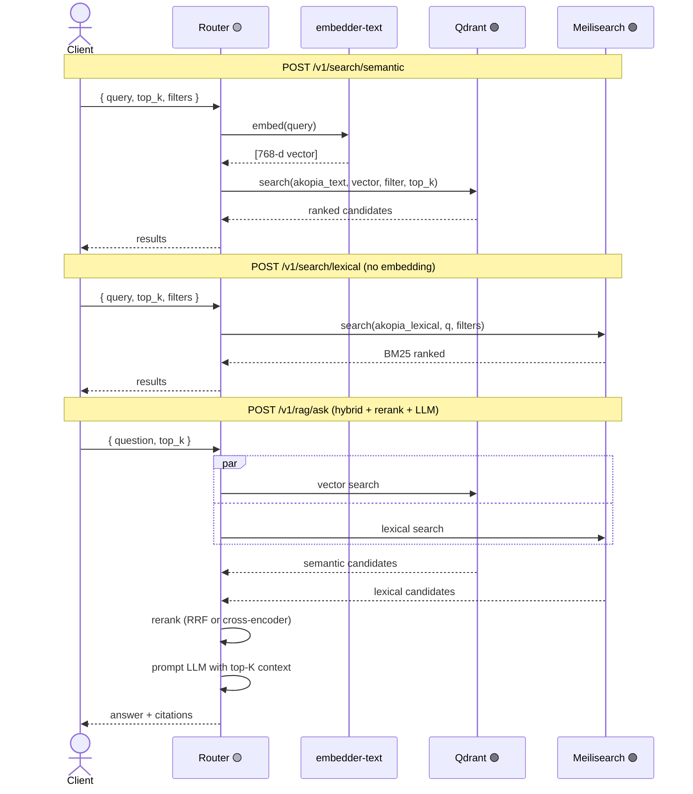

# Akopia — Architecture

**Status:** target architecture post plugin-contracts RFC.
**Last update:** 2026-04-22.
**See also:** `docs/plugin-contracts.md` for the pluggable interfaces.

This document is the reference for how akopia is structured. Use it
when deciding where a new feature lives, how deployments differ across
environments, or what a component is supposed to do.

## Reading key

Each component is tagged with a **status semaphore** and operational
metadata inside its box:

| Marker | Meaning |
|---|---|
| 🟢 | Exists and works as-is (no changes needed) |
| 🟡 | Exists, needs refactor (behaviour preserved, shape changes) |
| 🔴 | New, build from scratch |
| `H` | Horizontal scale — can run multiple replicas |
| `S` | Singular — must run as a single instance |
| `~XGi` | Approximate memory footprint per replica at nominal load |

A component labeled `[optional]` is only required when a specific
modality or feature is used.

## 1. Layered architecture with plugin tiers

```mermaid
flowchart TB
    classDef core fill:#fef3c7,stroke:#d97706,color:#78350f
    classDef plugin fill:#e0e7ff,stroke:#6366f1,color:#312e81
    classDef store fill:#dcfce7,stroke:#16a34a,color:#14532d
    classDef bus fill:#fce7f3,stroke:#be185d,color:#500724
    classDef fw fill:#fff7ed,stroke:#c2410c,color:#7c2d12,stroke-dasharray: 4 3
    classDef ext fill:#f1f5f9,stroke:#64748b,color:#1e293b

    %% External
    subgraph External[External actors]
        user([Users / App]):::ext
        mcp([MCP clients]):::ext
        gh([git provider<br/>GitHub / GitLab / Gitea]):::ext
        fs([Filesystem / NAS]):::ext
        web([Web resources<br/>URLs]):::ext
    end

    %% Layer 3: Sources
    subgraph L3["Layer 3 · Sources · pluggable · at least one required"]
        direction LR
        git["<b>git 🟡</b><br/>H · ~150 MiB"]:::plugin
        folder["<b>folder 🟡</b><br/>H · ~100 MiB"]:::plugin
        webs["<b>web-single 🔴</b><br/>H · ~100 MiB"]:::plugin
        webd["<b>web-deep 🔴</b><br/>H · ~150 MiB"]:::plugin
        s3src["<b>s3 🔴 [post-launch]</b><br/>H · ~100 MiB"]:::plugin
        dblive["<b>db-live 🔴 [post-launch]</b><br/>H · ~150 MiB"]:::plugin
    end

    %% Layer 2: Extractors
    subgraph L2["Layer 2 · Extractors · pluggable · at least one required · plain recommended"]
        direction LR
        plain["<b>plain 🔴</b><br/>H · ~100 MiB"]:::plugin
        office["<b>office 🔴</b><br/>H · ~400 MiB"]:::plugin
        pdft["<b>pdf-text 🔴</b><br/>H · ~250 MiB"]:::plugin
        html["<b>html 🔴</b><br/>H · ~150 MiB"]:::plugin
        ocr["<b>ocr 🔴 [post-launch]</b><br/>H · ~500 MiB + tesseract"]:::plugin
        asr["<b>asr 🔴 [post-launch]</b><br/>H · ~2 GiB + whisper"]:::plugin
    end

    %% Layer 1: Core
    subgraph L1["Layer 1 · Core · fixed"]
        direction TB
        router["<b>router 🟡</b><br/>S · ~500 MiB<br/>idempotency · routing · DLQ"]:::core
        chunker["<b>chunker 🟢</b><br/>in-router · negligible"]:::core
        embedText["<b>embedder-text 🟡</b><br/>H · ~2-4 GiB<br/>[required]"]:::core
        embedImg["<b>embedder-image 🟡</b><br/>H · ~1-2 GiB<br/>[optional]"]:::core
        mcpsrv["<b>mcp-server 🟢</b><br/>H · ~150 MiB<br/>[optional proxy]"]:::core
    end

    %% Framework (cross-cutting abstraction)
    subgraph FW["Framework · cross-cutting"]
        base_adapter["<b>BaseSourceAdapter 🔴</b><br/>absorbs: bus I/O · idempotency<br/>· health · metrics · shutdown"]:::fw
        base_extractor["<b>BaseExtractor 🔴</b><br/>absorbs: bus I/O · caching<br/>· timeout · DLQ · metrics"]:::fw
    end

    %% Event bus
    subgraph Bus["Event bus · Redis Streams"]
        direction LR
        s_change["change-events 🟢<br/>S · 5 GiB volume"]:::bus
        s_extract["extract-jobs 🔴"]:::bus
        s_extract_res["extract-results 🔴"]:::bus
        s_embed["embedding-jobs 🟢"]:::bus
        s_embed_res["embedding-results 🟢"]:::bus
        s_dlq["dead-letter 🟡<br/>with drainer"]:::bus
    end

    %% Storage
    subgraph Store["Storage · fixed (opinionated)"]
        direction LR
        qdr["<b>Qdrant 🟢</b><br/>S · ~1-2 GiB<br/>20 GiB volume"]:::store
        meili["<b>Meilisearch 🟢</b><br/>S · ~500 MiB<br/>10 GiB volume"]:::store
        preprocess["<b>preprocess-cache 🟢</b><br/>20 GiB volume"]:::store
    end

    %% External → Sources
    gh --> git
    fs --> folder
    web --> webs
    web --> webd

    %% Sources → Bus
    git & folder & webs & webd & s3src & dblive -.inherit from.-> base_adapter
    git & folder & webs & webd --> s_change

    %% Bus → Router
    s_change --> router

    %% Router ↔ Extractors (via extract streams)
    router --> s_extract
    s_extract --> plain & office & pdft & html & ocr & asr
    plain & office & pdft & html & ocr & asr -.inherit from.-> base_extractor
    plain & office & pdft & html & ocr & asr --> s_extract_res
    s_extract_res --> router
    plain & office & pdft & html -.-> preprocess

    %% Router → Embedders
    router --> chunker
    chunker --> s_embed
    s_embed --> embedText & embedImg
    embedText & embedImg --> s_embed_res
    s_embed_res --> router

    %% Router → Storage
    router -->|upsert vectors| qdr
    router -->|upsert snippets + metadata| meili

    %% Attached content loop
    plain & office & pdft -.->|attached images<br/>depth+1, max 3| s_change

    %% Query path
    user -->|HTTP + Bearer| router
    mcp -->|SSE| mcpsrv
    mcpsrv --> router
    qdr -.->|search| router
    meili -.->|search| router

    %% DLQ
    embedText & embedImg & router -.->|failures| s_dlq
```



## 2. Deployment modes & component matrix

The platform supports three deployment tiers. The *same code* runs in
all three — only packaging and persistence differ.

### Component matrix

| Component | Status | Scale | Memory | Mandatory? |
|---|---|---|---|---|
| Qdrant | 🟢 | S | 1–2 GiB | ✅ always |
| Meilisearch | 🟢 | S | 500 MiB | ✅ always |
| Redis (event bus) | 🟢 | S | 256 MiB | ✅ always |
| Router (core) | 🟡 | S | 500 MiB | ✅ always |
| embedder-text | 🟡 | H | 2–4 GiB | ✅ if any text modality indexed |
| embedder-image | 🟡 | H | 1–2 GiB | ⚪ only if image modality indexed |
| mcp-server | 🟢 | H | 150 MiB | ⚪ only if MCP clients will connect |
| At least one SourceAdapter | 🟡/🔴 | H | ~100–150 MiB each | ✅ at least one |
| At least one ContentExtractor | 🔴 | H | 100 MiB – 2 GiB | ✅ at least one (`plain` recommended) |
| Framework `Base*` classes | 🔴 | — | — | ✅ consumed by every plugin |

**"At least one" rule:** the platform rejects a config with zero sources
or zero extractors at startup with a clear error message. Typical minimal
valid deployments:

- **Text-only**: 1 git source + `plain` extractor + embedder-text → Qdrant/Meili. No image stack needed. ~5 containers, ~4 GiB total.
- **Office-docs**: 1 folder source + `plain` + `office` + `pdf-text` → embedder-text → stores. ~6 containers, ~5 GiB total.
- **Full multimodal**: 1 git + 1 folder + 1 web-deep + all 6 extractors + both embedders. ~12 containers, ~12 GiB total.

### Deployment tiers

| Tier | Target | Packaging | Persistence | Complexity |
|---|---|---|---|---|
| **Solo-dev** | Local trial, CI | `docker compose up` | named Docker volumes | 5 min, 4 GiB RAM |
| **Single-host** | Team of 5–10, 1 server | Docker Compose + systemd + bind mounts | host-mounted volumes, daily backup cron | 30 min, 8 GiB RAM |
| **Kubernetes** | Production, multi-replica | manifests (current) or Helm chart (post-launch) | Longhorn + MinIO backup | k8s expertise required |

## 3. Base framework: standardised I/O for plugins 🔴

The key abstraction that keeps plugin authoring simple.

**`BaseSourceAdapter`** (in `common/base_adapter.py`, new) absorbs everything cross-cutting:

- Subscribing to/publishing on Redis streams
- Computing + tracking idempotency keys
- Prometheus metric emission (`source_adapter_events_total`, `source_adapter_errors_total`, `source_adapter_poll_duration_seconds`)
- Health probe endpoint compatible with k8s + docker healthcheck
- Graceful shutdown on SIGTERM
- Structured JSON logs with plugin_id / source_id context

**`BaseExtractor`** (in `common/base_extractor.py`, new) absorbs:

- `extract-jobs` consumption, `extract-results` publishing
- Retrieval of `content_ref` bytes (fetches file, URL, or inlines)
- Timeout enforcement (fail-fast on runaway extractors)
- Caching by `sha256(content)` → `ExtractedContent` in `preprocess-cache`
- DLQ publishing on failure, preserving the original job
- Metrics (`extractor_jobs_total`, `extractor_latency_seconds`, `extractor_failures_total`)

**What the plugin author writes.** Only the protocol methods specified
in `plugin-contracts.md` — typically ~50–100 lines for an adapter, ~20–50
for an extractor. All transport, resilience, observability boilerplate
is inherited from the base class.

This is the "standardised communication in and out" the OSS platform
needs: contributors focus on the adapter logic, not the plumbing.

## 4. Data model

The canonical messages are defined in `common/models.py`.

### `ChangeEvent` 🟡

Emitted by source adapters. Flows through `change-events` stream.

Extensions from current model:

- `content_ref: ContentRef` 🔴 — explicit retrieval strategy (path / inline bytes / URL / object storage)
- `content_mime: Optional[str]` 🔴 — explicit MIME override when extension is ambiguous
- `depth: int = 0` 🔴 — incremented by extractors on attached content; router rejects at `depth >= 3`

### `ExtractedContent` 🔴

Emitted by extractors. Flows through `extract-results`.

Fields: `text`, `pages[]`, `structure`, `metadata`, `attached[]`. See `plugin-contracts.md` §Data model for full schema.

### `EmbeddingJob` / `EmbeddingResult` 🟢

Unchanged from current implementation.

## 5. Event bus

All inter-component communication is via Redis streams. Five canonical streams + one DLQ:

| Stream | Producer(s) | Consumer group | Consumer(s) | Status |
|---|---|---|---|---|
| `change-events` | source adapters | `cg-router` | router | 🟢 |
| `extract-jobs` | router | `cg-extract-{plugin_id}` | extractor matching MIME/ext | 🔴 |
| `extract-results` | extractors | `cg-router-extract` | router | 🔴 |
| `embedding-jobs` | router | `cg-embedder` | embedder-text / embedder-image | 🟢 |
| `embedding-results` | embedders | `cg-router-embed` | router | 🟢 |
| `dead-letter` | any | `cg-ops` | drainer worker 🔴 | 🟡 |

The `dead-letter` has a **drainer worker** in the target state:

- Inspects DLQ entries, reads `retry_count`, decides retry vs terminal
- Exponential backoff (1 min, 5 min, 15 min, then terminal)
- Republishes to the originating stream with `retry_count + 1` for retryable failures
- Preserves the full original job payload (current behaviour drops the
  job, keeps only the result — 🟡 fixing)

## 6. Modalities × Extractors

The user-visible result of the plugin system: which source+extractor
combinations work, where.

| File type / source | Source adapter | Extractor | Vector collection |
|---|---|---|---|
| `.py`, `.md`, `.txt`, `.json`, `.yaml`, `.csv` | `git` / `folder` | `plain` | `akopia_text` (768-d) |
| `.docx`, `.xlsx`, `.pptx`, `.odt`, `.ods`, `.odp` | any | `office` | `akopia_text` (768-d) |
| `.pdf` (text-native) | any | `pdf-text` | `akopia_text` (768-d) |
| `.pdf` (scanned) | any | `ocr` [post-launch] | `akopia_text` (768-d) |
| `.html` (file) | `git` / `folder` | `html` | `akopia_text` (768-d) |
| Web pages | `web-single` / `web-deep` | `html` (auto-invoked) | `akopia_text` (768-d) |
| `.jpg`, `.png`, `.webp` | `git` / `folder` | — (CLIP eats pixels) | `akopia_image` (512-d) |
| `.mp3`, `.wav` | any | `asr` [post-launch] | `akopia_text` tagged `audio_transcript` |
| `.mp4`, `.webm` | any | `asr` + keyframe extractor [post-launch] | both `akopia_text` and `akopia_image` |

### 6.1 Image ingestion path — shared-volume contract

Image embedding does not go through a text extractor; `fastembed.ImageEmbedding.embed(paths)`
reads the file bytes from disk directly. That means the `embeddings`
container must see the **same absolute path** the adapter stamped onto
the `ChangeEvent.content_ref`.

The default `docker-compose.yml` achieves this by mounting the
`git-repos` named volume (where `plugin-adapter-git` clones) and
`./data/docs` (where `plugin-adapter-folder` points) read-only on the
`embeddings` service. The git and folder adapters both produce
`ContentRef(kind="path", path="/tmp/akopia-repos/…")` or
`/data/docs/…` respectively.

When a new source adapter is added, the ops author must decide one of:

- Mount the adapter's data directory on `embeddings` read-only, **or**
- Have the adapter emit `ContentRef(kind="inline_bytes", …)` and extend
  `_image_path_for` in `concentrador/main.py` to materialise the bytes
  to a temp file before dispatch, **or**
- Accept that that source won't contribute to the `akopia_image` collection.

Only the first option is wired today. Other modes are tracked against
the checklist in `docs/adding-a-modality.md`.

## 7. Query path

End-user queries hit the router. Three modes of retrieval:



### Freshness controls

All three search endpoints (`/v1/search/semantic`, `/v1/search/lexical`,
`/v1/rag/ask`) accept two freshness knobs that share the
`content_modified_at` metadata stamped by adapters at ingest time:

- `max_age_days: Optional[int]` — hard filter. Excludes docs whose
  `content_modified_at` is older than `now - N` days. Qdrant range
  filter on `content_modified_ts` (epoch seconds); Meili uses the
  same attribute declared filterable+sortable. Docs without the field
  are excluded by the filter (treated as unknown age).
- `freshness_boost: float ∈ [0,1]` — soft re-rank. For each candidate
  `score_final = (1-β) * score_vector + β * exp(-age_days / 180)`.
  Docs without `content_modified_at` use a neutral `fresh_score = 0.5`.

Both default to off (`None` / `0.0`) so existing callers see identical
behaviour. Backfill for pre-feature ingests is a one-shot script
(`scripts/backfill_content_modified.py`, deferred).

## 8. Persistence

| Volume | Size (default) | Backend | Purpose | Regenerable? |
|---|---|---|---|---|
| `qdrant-data` | 20 GiB | Longhorn / named volume | Vector DB indices | ❌ costly re-embed |
| `meilisearch-data` | 10 GiB | Longhorn / named volume | Lexical indices + snippets | ❌ same |
| `redis-data` | 5 GiB | Longhorn / named volume | Streams + watermarks + idempotency | ⚠ data loss ⇒ duplicate processing |
| `preprocess-cache` | 20 GiB | local-path / named volume | Extractor output cache keyed by content hash | ✅ regenerable |
| `git-repos-cache` | 20 GiB | local-path / named volume | Git clones maintained by `git` adapter | ✅ re-clonable |
| *(adapter-specific)* | varies | adapter decides | e.g. `nas-knowledge-ro` for folder adapter mounting NAS | depends on source |

**🔴 to fix:** `backing-services.yaml` currently declares `emptyDir` for
Redis/Qdrant/Meili. Must be changed to named PVC references before OSS
release — otherwise a fresh `kubectl apply` loses data on first restart.

## 9. Authentication

### v1 (MVP) 🟡

Single static bearer token, stored as `AKOPIA_BEARER_TOKEN` env var /
k8s secret. All endpoints that mutate or read data require
`Authorization: Bearer <token>`. Health endpoints are open.

- Qdrant: no API key (intra-cluster only; `QDRANT_API_KEY` supported but
  not set in default deployment).
- Meilisearch: `MEILI_MASTER_KEY` env.
- Upstream source credentials (`GITHUB_TOKEN`, etc.) live in akopia.yaml
  with `${ENV}` interpolation.

### Post-launch 🔴

Per-tenant API keys (Postgres-backed), per-key rate limits, per-key
source-visibility scopes. Out of scope for the v1 OSS release.

## 10. Failure modes and observability

### Known failure modes (with target mitigation)

| Symptom | Root cause | Target mitigation |
|---|---|---|
| Embedder OOMKilled | Model + batch activations exceed memory limit | Already: limit raised to 8 GiB (2026-04-22). Longer: quantized models (Q), image/text pod split, TEI for text. |
| DLQ grows silently | No drainer worker; only length exposed | 🔴 implement drainer with exponential backoff. Prometheus alert when DLQ > N. |
| Duplicate processing on Redis wipe | Idempotency hashes in Redis; wipe resets them | Redis data is persistent (5 GiB PVC). Don't disable. If must migrate: export idempotency set first. |
| Extractor hangs on malformed file | No timeout in current impl | 🔴 `BaseExtractor` enforces per-job timeout. Defaults to 60 s, configurable per plugin. |
| Webhook-driven source misses events during downtime | Source pulls on reconnect, but push events are lost | 🔴 source adapters that expose webhooks must persist watermarks to `source-state` hash in Redis. |

### Observability

- **Metrics.** Prometheus exposition on every service. Standard metric names as documented in plugin-contracts.md §5.
- **Logs.** Structured JSON, fields: `timestamp`, `level`, `plugin_id`, `source_id`, `event_id`, `message`, `error`.
- **Traces.** OpenTelemetry instrumentation in Base* classes 🔴. Traces span from source event to embedding upsert. Backend: Grafana Tempo or Jaeger (deployment-time choice).

## 11. What this document does NOT cover

- Concrete performance benchmarks (p50/p95 latency, throughput). To be
  measured against target deployments once refactor lands.
- Multi-tenancy. Platform is single-tenant in v1.
- Backup + restore procedure. Longhorn recurring jobs exist for
  k8s mode; docker-compose mode documentation 🔴.
- Cold start of embedder (lazy model load = ~90 s hang on first
  request of a fresh pod). Mitigation: eager load on startup or
  init-container pre-download 🔴.

---

## Appendix A: current state (pre-refactor)

As of 2026-04-22, the cluster namespace `akopia` runs:

```
NAME                            READY   RESTARTS   NOTES
adapter-git                     1/1     0          source-side, Gitea-coupled
adapter-nas                     1/1     0          out-of-tree (undocumented)
concentrador                    1/1     7          target: split into router + text embedder
embeddings                      1/1     0          OOM fix applied 2026-04-22
mcp-server                      1/1     0          healthy
redis                           1/1     0          healthy
qdrant                          1/1     0          healthy
meilisearch                     1/1     0          healthy
```

Code locations (before refactor):

- Source adapters: `adapter_git/main.py` (git) + `adapter-nas` in k8s manifests only (no source in repo)
- Extractors: none — modality handling is inline in `concentrador/main.py:490-590` as if/elif blocks
- Bus: `concentrador/main.py`, `embeddings/main.py`, and `adapter_git/main.py` each open their own Redis connection with hardcoded stream names
- Models: `common/models.py` — already contains `ChangeEvent`, `EmbeddingJob`, `EmbeddingResult`, `DerivedContent` but lacks `ContentRef` and `ExtractedContent`

The refactor proceeds slice by slice, preserving the running system
throughout. The first slice is the framework (base classes + extended
models + plugin registry), added without changing runtime behaviour. The
final slice switches the concentrador's modality-if-elif to the router.
Each slice is green-bar on contract tests before proceeding.
